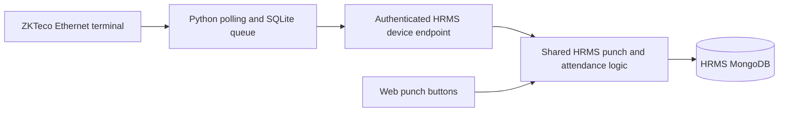

# ZKTeco integration

This folder owns the device integration: the Python bridge, administration commands,
HRMS ingestion code, collection definitions, documentation, and existing tests.

## Daily startup

Your two-terminal setup is sufficient. Run these from the HRMS project directory:

```powershell
# Terminal 1: HRMS on localhost:3000
npm run dev
```

```powershell
# Terminal 2: keep the device bridge running
npm run device:bridge
```

Additional import command is required for everyday punching.
The configured device is `192.168.1.201:4370`. The bridge reads its saved configuration
from `.local/zkteco/config.json` and sends scans to the configured HRMS URL.

Alternatively, `npm run dev:device` starts both processes in one terminal. Use one
startup method at a time. `npm run start:device` serves an already built production
app alongside the bridge; it does not build the app.

After this source reorganization, stop and restart an existing bridge using the same
`npm run device:bridge` command. Restart an existing development server once to load
the new TypeScript path alias. Keep the saved configuration and queue in place;
roster synchronization and onboarding do not need to be repeated.

## Why the bridge and two languages are present

The installed `pyzk` library is Python code that communicates with the Ethernet
terminal. The bridge polls the terminal, saves scans in a durable local SQLite
queue, and retries delivery to HRMS. It must run on a computer that can reach the
device. A hosted HRMS app can receive its HTTPS requests without being on that LAN.

The `.mjs` commands use the application's Node dependencies for environment loading,
Excel parsing, and MongoDB administration. `cli/run-device.mjs` also launches Python so the
daily command stays `npm run device:bridge`. Employee import commands run only when
explicitly invoked; they are not another background service.

The TypeScript server code authenticates scans, resolves permanent employee IDs,
and calls the existing HRMS attendance policy. Python never writes attendance
directly to MongoDB. Keeping the bridge separate also lets web punching continue
when the terminal or bridge is unavailable.



## Folder map

| Path               | Responsibility                                                                              |
| ------------------ | ------------------------------------------------------------------------------------------- |
| `cli/`             | Small command entry points, configuration, and process startup                              |
| `bridge/`          | Python connection, user sync, scan conversion, queue, polling, and delivery modules         |
| `admin/roster/`    | Workbook parsing and existing-employee reconciliation                                       |
| `admin/link/`      | Identity matching, terminal location registration, transactional writes, and read-back      |
| `admin/onboard/`   | Explicit salary/gender rules, import planning, employee creation, and read-back             |
| `server/`          | Device request protocol, identity resolution, ingestion, and MongoDB collection definitions |
| `tests/`           | Relocated test definitions; not run during this refactor                                    |
| `docs/`            | Detailed operations and maintenance guides                                                  |
| `requirements.txt` | Python dependency for the bridge (`pyzk==0.9`)                                              |

Shared web attendance and night-sweep code remains in `src/lib/`. Next.js requires
the route adapter at `src/app/api/devices/zkteco/punch/route.ts`; that file only
exports the handler from this folder. General database setup imports the device
collection definitions from `server/device-collection-schema.mjs`.

Private runtime data intentionally remains in the Git-ignored `.local/zkteco/`
directory: configuration, employee exports, mapping files, backups, aliases, and
the existing SQLite queue. Moving or recreating that queue could lose pending
scans or change the original import cutoff. None of that data was migrated or reset.

## User punch access

In **Users → Add user**, choose **Punch in/out access**. Existing accounts have the
same selector in the user list:

| Option           | Web dashboard buttons | ZKTeco scans                               |
| ---------------- | --------------------- | ------------------------------------------ |
| Web + ZKTeco     | Enabled               | Accepted under HRMS attendance policy      |
| Web              | Enabled               | Ignored with an access-restriction receipt |
| ZKTeco           | Disabled              | Accepted under HRMS attendance policy      |

ZKTeco-only accounts keep their attendance history and worked time on the dashboard.
They do not request browser location or show browser location warnings. The terminal
continues using its registered office coordinates and the existing attendance policy.

The setting is stored as `users.punch_access` and enforced by both server punch paths.
An open dashboard refreshes access on focus and every 15 seconds while visible; it
also refreshes access before a web punch requests location. Existing accounts with
no saved setting retain both methods. Linked employees without a login retain their
existing device access. Creating or changing this setting does not enroll a device
user or replace the required employee/device identity link.

## Commands

| Command                                                | Purpose                                                                |
| ------------------------------------------------------ | ---------------------------------------------------------------------- |
| `npm run device:bridge`                                | Continuous device polling and delivery                                 |
| `npm run device:status`                                | Read pending scans, last errors, and review outcomes locally           |
| `npm run device:inspect`                               | Read terminal information and save an inventory                        |
| `npm run device:configure`                             | Save matching local bridge/server settings; no device or DB connection |
| `npm run device:roster -- --file "PATH/Employee.xlsx"` | Export workbook identities                                             |
| `npm run device:sync-users`                            | Preview terminal name/ID updates and new normal users                  |
| `npm run device:link -- ...`                           | Preview HRMS identity links and office registration                    |
| `npm run device:onboard -- ...`                        | Preview employee creation/updates from the workbook and explicit rules |

Administration commands require their documented input files. `sync-users`, `link`,
and `onboard` save changes only with `--apply`. For npm commands, put flags after
`--`, for example `npm run device:sync-users -- --mapping .local/zkteco/uid-map.json --apply`.
Stop the bridge before device inspection or user synchronization because those
commands share the terminal lock. `device:status` can run while the bridge runs.

For a new bridge computer, install Python dependencies with
`python -m pip install -r zkteco/requirements.txt`. The existing computer already has
the library. Set `ZKTECO_PYTHON` if a specific Python executable is required.

See [operations](docs/operations.md) for setup and troubleshooting, and
[maintenance](docs/maintenance.md) for code ownership and attendance invariants.
Tests, builds, lint, type checks, and a live punch trial remain deferred at the
user's request. This refactor has not started the bridge or rerun employee imports.
